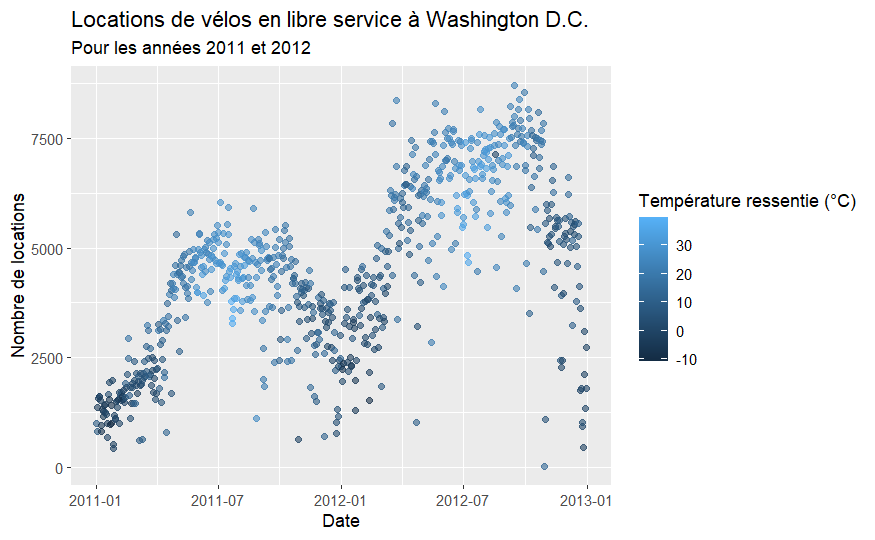

# EXAMEN 2

## Consignes

1.  Vos solutions doivent être rédigées dans le fichier R Markdown (Rmd) appelé exam-01.Rmd. Ce fichier doit inclure votre code et votre rédaction pour chaque question. Votre “soumission” sera ce qui se trouve dans votre dépôt d’examen à la date limite. Commitez et poussez les fichiers Rmd et md produits.

2.  Cet examen est à livre ouvert, internet ouvert, autres personnes fermées. Vous pouvez utiliser toutes les ressources en ligne ou basées sur des livres que vous souhaitez, mais vous devez inclure des citations pour tout code que vous utilisez (directement ou indirectement). Vous ne pouvez pas consulter quelqu’un d’autre à propos de cet examen à part les encadrants du cours. Vous ne pouvez pas poser de questions directes sur internet. Vous pouvez guider vos camarades vers les bonnes ressources, mais ne pas leur donner de réponses directes.

3.  Vous avez jusqu’au **20.12.2024** pour compléter cet examen et le rendre via votre dépôt personnel Github - les travaux en retard seront pénalisés. Les difficultés techniques ne sont pas une excuse pour les travaux en retard - n'attendez pas la dernière minute pour knitt / commit / push.

4.  Chaque question nécessite une (brève) narration ainsi qu’une (brève) description de votre approche. Vous pouvez utiliser des commentaires dans votre code, mais ne comptez pas exclusivement sur ceux-ci. Nous devrions pouvoir supprimer tout le code dans votre document et toujours pouvoir lire et comprendre vos réponses. Utilisez le texte entre les blocs de code pour cela.

5.  Même si la réponse semble évidente à partir de la sortie R, assurez-vous de l’énoncer également dans votre narration. Par exemple, si la question demande ce que fait 2 + 2, et que vous avez ce qui suit dans votre document, vous devriez également avoir une phrase qui dit “2 + 2 fait 4.”

``` r
2 + 2
# 4
```


## Déclaration d’intégrité académique

*JE, [VOTRE NOM], déclare que l'ensemble du travail produit est le mien et qu'il n'a pas été produit par une autre personne ou un logiciel.*

**Note sur la réutilisation de code:** Je suis bien conscient qu'un grand volume de code est disponible sur le web pour résoudre un certain nombre de problèmes. Pour cet examen, vous êtes autorisé à utiliser toutes les ressources en ligne (par exemple, StackOverflow), mais vous devez citer explicitement l'endroit où vous avez obtenu tout code que vous utilisez directement (ou utilisez comme inspiration). Vous n'êtes pas autorisé à poser une question sur un forum externe, vous ne pouvez utiliser que des réponses à des questions qui ont déjà été posées. Tout code recyclé qui est découvert et n'est pas explicitement cité sera traité comme du plagiat. Les communications avec des camarades de classe doit se limiter à résoudre des problèmes élémentaires: il n'est pas autoriser de reprendre le travail d'un camarade. L'utilisation d'IA générative n'est pas autorisée.

## Obtenir de l’aide
Vous pouvez poser des simples questions à vos camarades de classe, mais vous ne pouvez pas partager de code. Vous ne pouvez pas poser de questions sur Internet. Si vous avez des questions sur l’examen, vous pouvez également les poser au personnel encadrant.

## Évaluation
Le total des points pour les questions s’élève à 140 points. Les 10 points restants sont attribués au style de code, à la fréquence et aux messages de commit, à l’organisation générale, à l’orthographe, à la grammaire, etc. Il y a une question bonus d'une valeur de 10 points

## Logistique
Répondez aux questions dans le document appelé exam-02.Rmd. Ajoutez votre code et votre narration dans les espaces sous chaque question. Ajoutez des blocs de code au besoin. Utilisez autant de lignes que nécessaire, mais gardez votre narration concise. Avant de terminer, assurez-vous de supprimer le code non nécessaire et de relire vos réponses une fois de plus. Assurez vous de ce qui est présent sur votre repository github avant la date limite. Assurez vous qu'un fichier HTML ou MD est présent dans votre repository.

## Packages
Vous aurez besoin des packages `tidyverse`, `lubridate` et `tidymodels`. Si ce n'est pas déjà fait, installez-les avant de les charger.

# Exercice 1 - Regression (90 points)

## Les données
Pour cet exercice, nous utiliserons les données d'utilisation des vélos en libre circulation à Washington, D.C. pour 2011 et 2012, avec les données de météo correspondantes. Les données sont disponibles dans le fichier `data/bikeshare.csv`.

Les colonnes du jeu de données sont les suivantes:

  - dteday: Date
  - season: Saison (1:printemps, 2:été, 3:automne, 4:hivers)
  - yr: Année (0: 2011, 1:2012)
  - mnth: Mois (1 to 12)
  - hr: Année (0 to 23)
  - holiday: Jour férié ou non
  - weekday: Jour de la semaine (0:dimanche, ..., 6:samedi)
  - workingday: 1 si c'est un jour ouvrable (lundi à vendredi, hors vacances), 0 sinon
  - weathersit: Météo
    - 1: Temps clair, peu de nuages, partiellement couvert
    - 2: Brouillard et nuageux, brouillard et partiellement nuageux, brouillard
    - 3: Faible neige, faible pluie et orage, faible pluie et nuageux
    - 4: Grosse pluie, grèle, tempête, neige et brouillard
  - temp: Température normalisée en degrés Celsius ($t_min = -8$ et $t_max = +39$)
  - atemp: Température ressentie normalisée en degrés Celsius ($t_min = -16$ et $t_max = +50$)
  - hum: Humidité normalisée (avec comme valeur maximale 100)
  - windspeed: Vitesse du vent normalisée en km/h (avec comme valeur maximale 67)
  - casual: Nombre d'utilisateurs casuels
  - registered: Nombre d'utilisateurs enregistrés (abonnement annuel)
  - cnt: Nombre total d'utilisateurs (casual + registered)

## Questions

1.  **Question 1 (5 points)** - Recodez la variable `season` pour en faire un `factor` avec les niveaux suivants: "printemps", "été", "automne", "hiver". Assurez vous que le premire niveau soit "printemps". Recodez les variables `holiday` et `workingday` en `factor` également avec les niveaux "non" et "oui", avec "non" comme premier niveau. Recodez la variable `yr` en `factor` avec les niveaux "2011" et "2012". Recodez la variable `weathersit` en `factor` avec les niveaux suivants: 1 - "Temps clair", 2 - "Brouillard", 3 - "Légères précipitations", et 4 - "Fortes précipitations".

Utilisez le package `lubridate` pour transformer la variable `dteday` en une variable de type `date`.

    
2.  **Question 2 (10 points)** - Calculez les valeurs absolues pour les variables `temp`, `atemp`, `hum` et `windspeed`, en multipliant les valeurs normalisées par leurs valeurs minimales et maximales.


    
3.  **Question 3 (5 points)** - Assurez vous que les variables `casual` et `registered` s'additionnent bien pour donner la variable `cnt`. 

*Indice:* Une possibilité est de créer une nouvelle colonne qui contient la valeur `TRUE` si la somme est égale à `cnt` et `FALSE` sinon. Vous pouvez ensuite utiliser cette colonne pour vérifier si la somme est correcte.


4.  **Question 4 (10 points)** - Recréez le graphique ci-dessous. Une fois que vous avez créé la visualisation, décrivez en un paragraphe ce que vous pensez être le point de cette visualisation.




Analysez le graphique et indiquez ce que vous en comprenez.

5.  **Question 5 (10 points)** - Créez un graphique montrant la relation entre le nombre de location de vélos et la saison. Interprétez votre graphique

----
Commencez par séparer les données en un ensemble d'entraînement et un ensemble de test. Utilisez 80% des données pour l'entraînement et 20% pour le test. Pour les questions suivantes, utilisez l'ensemble d'entraînement pour ajuster les modèles et l'ensemble de test pour évaluer les modèles.

6.  **Question 6 (10 points)** - Créez un modèle linéaire prédisant le nombre total de locations de vélos à partir de la température quotidienne. Interprétez la pente et l'ordonnée à l'origine, et déterminez et interprétez le $R^2$.

7.  **Question 7 (10 points)** - Créez un autre modèle linéaire prédisant le nombre total de locations de vélos à partir de la température ressentie quotidienne. Interprétez la pente et l'ordonnée à l'origine, et déterminez et interprétez le $R^2$.

Quelle est la différence entre les deux modèles? Lequel est le meilleur prédicteur des locations de vélos? Expliquez votre raisonnement.

8. **Question 8 (15 points)** - Créez un modèle prédisant le nombre total de locations de vélos à partir de la saison, de l'année, du fait que le jour est férié ou non, du fait que le jour est un jour ouvrable ou non, de la météo, de la température, de la température ressentie, de l'humidité et de la vitesse du vent. Interprétez le $R^2$ ajusté du modèle.

*Indice*: Pensez à créer une recette dans laquelle vous pourrez créer des *dummy variables* pour les variables catégorielles.

Représentez, pour les données de test, les valeurs prédites par le modèle en fonction des valeurs observées.

9. **Question 9 (15 points)** - Créez un modèle similaire à celui de la Question 7 en séparant les données entre les jours fériés et non fériés. 


*Indice*: Pour cette question, séparez vos données selon la variable `holiday` et entrainez un modèle pour chaque groupe. Séparez également vos données de test pour tester vos deux modèles. 

Comparez, pour chaque modèle, la pente de la température et de la température ressentie. Y a-t-il une différence entre les deux modèles? Si oui, pourquoi?


# Exercice 2 - Classification (50 points)

## Les données

Pour cet exercice, nous allons utiliser les données sur les passagers du Titanic. Les données sont présentes dans le fichier `data/Titanic.csv`. L'objectif est de prédire si un passager a survécu ou non au naufrage du Titanic.

Les colonnes du jeu de données sont les suivantes:

  - PassengerId: Identifiant du passager
  - Survived: Survie (0 = Non, 1 = Oui)
  - Pclass: Classe du passager (1 = 1ère, 2 = 2ème, 3 = 3ème)
  - Name: Nom du passager
  - Sex: Sexe du passager
  - Age: Âge du passager
  - SibSp: Nombre de frères et soeurs / époux à bord
  - Parch: Nombre de parents / enfants à bord
  - Ticket: Numéro du ticket
  - Fare: Prix du ticket
  - Cabin: Numéro de cabine
  - Embarked: Port d'embarquement (C = Cherbourg, Q = Queenstown, S = Southampton)


## Questions

1. **Question 10 (5 points)** - Recodez la variable `Pclass` en `factor` avec les niveaux "1ère", "2ème" et "3ème". Recodez la variable `Survived` en `factor` avec les niveaux "Non" et "Oui". Recodez la variable `Embarked` en `factor` avec les niveaux "Cherbourg", "Queenstown" et "Southampton". Recodez la variable `Sex` en `factor` avec les niveaux "Femme" et "Homme".

3. **Question 11 (10 points)** - Certaines colonnes semblent avoir des valeurs manquantes. Comptez, pour chaque colonne le nombre de valeurs manquantes. Vous devriez obtenir les résultats suivants:

  - `Age`: 177 valeurs manquantes
  - `Cabin`: 687 valeurs manquantes
  - `Embarked`: 2 valeurs manquantes

Discutez de la manière dont vous pourriez traiter ces valeurs manquantes.

Pour la variable `Embarked`, supprimez les deux lignes avec des valeurs manquantes. Supprimez également la variable `Cabin` du jeu de données.

Pour la variable `Age`, nous allons imputer les valeurs manquantes en utilisant la moyenne de l'âge des passagers. Commencez par calculer la moyenne et la déviation stadard de l'âge des passagers. Nous allons ensuite remplacer les valeurs manquentes par des valeurs tirées d'une distribution normale avec la moyenne et la déviation standard calculées. Créez une nouvelle colonne `Age_calc` où la valeur de l'âge est égale à celle de `Age` si elle est disponible et à celle celle calculée si elle est manquante. Pour le calcul, vous pouvez utiliser la fonction `rnorm` pour générer des valeurs aléatoires à partir d'une distribution normale.

*Hint*: Si vous utilisez la fonction `rnorm` directement dans la fonction `mutate`, il n'y aura qu'un seul tirage de la distribution. Pour contourner ce problème, vous pouvez utiliser la fonction `map2` du package `purrr` pour appliquer la fonction `rnorm` à chaque ligne du jeu de données. La fonction `map2` prend une liste de valeurs et une fonction comme arguments. Cela pourrait ressembler à `mutate(Age_calc = map2(Age, is.na(Age), ~ ifelse(.y, rnorm(1, mean = [moyenne de l'age], sd = [déviation standard de l'age]), .x)))`.

*Hint*: En utilisant la fonction `rnorm`, vous pouvez obtenir des valeurs négatives pour l'âge. Une possibilité est de remplacer les valeurs négatives par 0. Une autre possibilité est d'utiliser la fonction `rtruncnorm` du package `truncnorm` (à installer) pour générer des valeurs tronquées.


2. **Question 12 (10 points)** - Combien de passagers ont survécu au naufrage du Titanic? Combien de passagers n'ont pas survécu? Créez une visualisation représentant la survie des passagers en fonction de la classe et du sexe des passagers.

Que pouvez vous en déduire?


Nous allons essayer de prédire la survie des passagers en fonction des différentes variables. Pour cela, nous allons séparer les données en un ensemble d'entraînement et un ensemble de test. Utilisez 80% des données pour l'entraînement et 20% pour le test.

5. **Question 13 (15 points)** - Créez un modèle de Random Forest pour prédire la survie des passagers en fonction de la classe, du sexe, de l'âge, du nombre de frères et soeurs / époux à bord, du nombre de parents / enfants à bord, du port d'embarquement et du prix du ticket.

Nous allons utiliser un Random Forest. Pour cela, vous pouvez utiliser le modèle suivant:

```
cores <- parallel::detectCores() # Pour accélérer les calculs

rf_mod <- 
  rand_forest(trees = 1000, mtry = 4, min_n= 2) %>% 
  set_engine("ranger", num.threads = cores) %>% 
  set_mode("classification")
```

Définissez ensuite une recette qui permet de modéliser la survie des passagers en fonction de la classe, du sexe, de l'âge, du nombre de frères et soeurs / époux à bord, du nombre de parents / enfants à bord, du port d'embarquement et du prix du ticket. Avec un random Forest, il n'est pas nécessaire de créer des *dummy variables*.

Créez un `workflow` et ajoutez-y le modèle et la recette.

Fittez votre modèle sur les données d'entrainement. 

5. **Question 14 (10 points)** - Testez votre modèle sur l'ensemble de test. Quelle précision du modèle obtenez-vous ?

À l'aide de la fonction `conf_mat`, qui prend comme premier argument la liste des vraies valeurs et en deuxième argument la liste des valeur prédites, affichez la matrice de confusion. Expliquez ce tableau.

Seriez-vous plus confiant dans la qualité de prédiction si le modèle prédit "Non" (pas de survie) ou s'il prédit "Oui" (survie).

6. **Question Bonus (10 points)** - À l'aide d'un test d'hypothèse, déterminez s'il y a une différence significative dans la proportion de survivants entre les hommes et les femmes. Utilisez un test de proportion pour comparer les deux groupes avec un niveau de signification de 5%.

